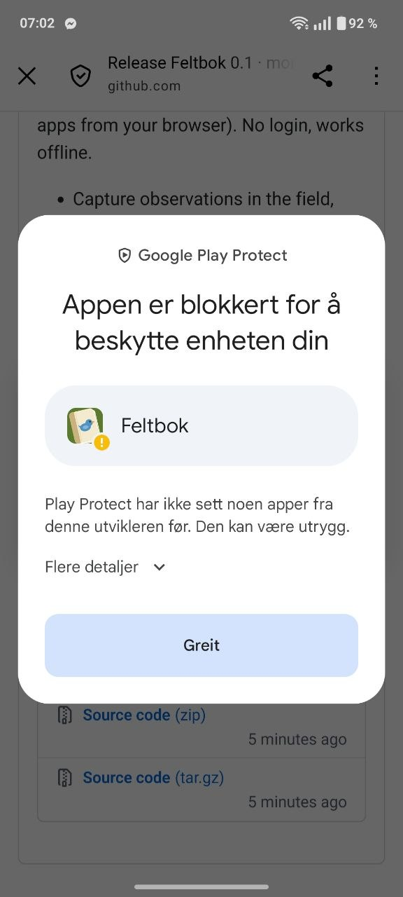
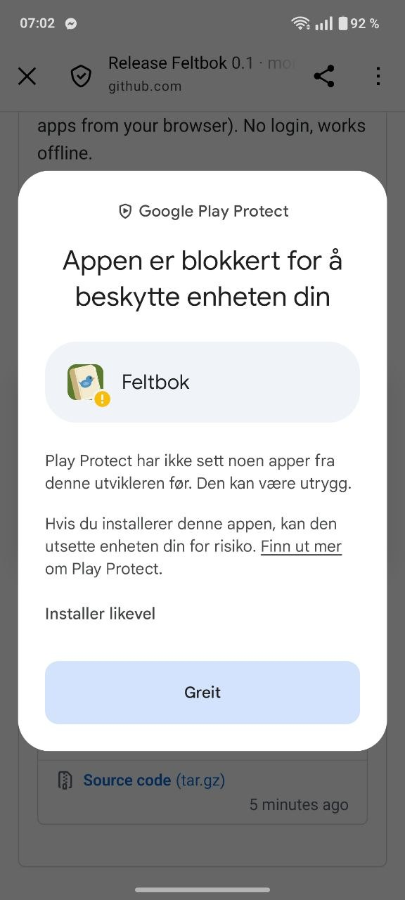

# Installere Feltbok

Feltbok ligger ikke i Google Play ennå, så du installerer den direkte fra GitHub.
Underveis viser Android en advarsel fra **Google Play Protect**, det er
irriterende men forventet (skyld på Google!)

1. Åpne [siste utgivelse](https://github.com/mortenfyhn/feltbok/releases/latest)
   og last ned `.apk`-fila
2. Trykk på fila når den er lastet ned. Første gang spør Android om nettleseren får
   «installere ukjente apper»: si ja og følg meldingen.
3. Play Protect sier **«Appen er blokkert for å beskytte enheten din»** fordi den
   ikke har sett apper fra denne utvikleren før. Trykk **Flere detaljer**.

   

4. Trykk **Installer likevel**.

   

5. Ferdig! Feltbok er nå installert.
